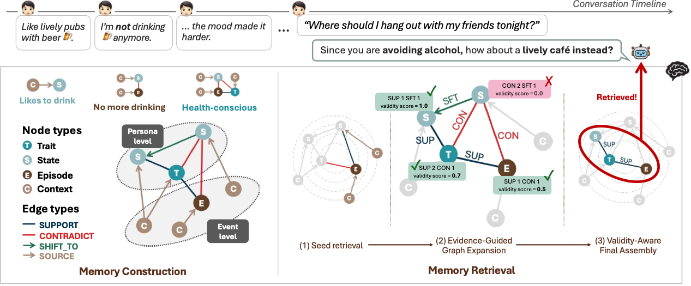

# PGMem: Tightly Coupled Persona–Memory Graph for Lifelong Personalized Agents

[](https://arxiv.org/abs/2608.01708)
[](https://2026.emnlp.org/)

**Wonjun Choi**<sup>1</sup>, **Yerim Kim**<sup>1</sup>, **Yukyung Lee**<sup>2,†</sup>, **Susik Yoon**<sup>1,†</sup>

<sup>1</sup>Korea University, Seoul, Korea &nbsp;&nbsp; <sup>2</sup>Boston University, Boston, USA

<sup>†</sup>Corresponding author

<p align="center">
  
</p>
<p align="center">
  <em>PGMem links event-level nodes (Context, Episode) and persona-level nodes (State, Trait)
  through typed provenance and evidence edges, then retrieves in three stages: seed retrieval,
  evidence-guided graph expansion, and validity-aware final assembly.</em>
</p>

## Abstract

Long-term personalized dialogue agents must track user preferences as their personas evolve.
Existing memory systems organize past events well, but store personas as flat profiles detached
from the events that justify them. This loose coupling leads to the memory-persona validity gap
and the persona-aware retrieval gap. We propose PGMem, a heterogeneous persona-memory graph that
connects event and persona nodes through typed provenance and evidence edges, keeping each persona
signal traceable to the events that support or revise it. At retrieval time, PGMem expands from
query-relevant seeds and ranks signals by evidential validity. Across three benchmarks with small
language model backbones, PGMem consistently outperforms summary-based, persona-aware,
graph-structured, and agentic memory baselines, and improves performance as the context grows.

## Links

- Paper (arXiv): https://arxiv.org/abs/2608.01708
- Venue: [EMNLP 2026](https://2026.emnlp.org/)

## Benchmarks

PGMem is evaluated on three benchmarks, each with a self-contained copy of the module under
`<benchmark>/pgmem/` and its own evaluation scripts under `<benchmark>/evaluation/`.

| Benchmark | Task | Evaluation |
|---|---|---|
| [ImplexConv](#implexconv) | Free-form QA over opposed personas | LLM-as-judge |
| [PersonaMem](#personamem) | Multiple-choice QA over long contexts | Exact match |
| [PrefEval](#prefeval) | Implicit-preference response generation | LLM-as-judge |

## Citation

```bibtex
@article{choi2026pgmem,
  title   = {PGMem: Tightly Coupled Persona--Memory Graph for Lifelong Personalized Agents},
  author  = {Choi, Wonjun and Kim, Yerim and Lee, Yukyung and Yoon, Susik},
  journal = {arXiv preprint arXiv:2608.01708},
  year    = {2026}
}
```

## Contact

{migreeni, dpfla274, susik}@korea.ac.kr, ylee5@bu.edu

---

## ImplexConv

PGMem on the ImplexConv dataset (QA-only).

### 1. Run the experiment

Builds memory from ground-truth turns and answers the QA.

```bash
python implexconv/pgmem/run_experiment.py \
  --start-session 0 --end-session 299 \
  --subset opposed \
  --model Qwen/Qwen3-1.7B \
  --max-model-len 30000 \
  --batch-size 1
```

| Arg | Description |
|------|------|
| `--start-session` / `--end-session` | (required) First / last session index, inclusive |
| `--subset` | (required) `opposed` or `supportive` |
| `--model` | HF model path (default from config) |
| `--max-model-len` | vLLM max context length |
| `--batch-size` | Sessions processed in parallel |
| `--config` | Config filename without `.py` (default: `config_0`) |

Outputs go to `implexconv/pgmem/config_0_outputs_<model>_<subset>/session_<start>_<end>/`.

### 2. Evaluation (LLM-as-judge, OpenAI Batch)

Auto-merges sessions `0..(session-num-1)` from every module's `config_*_<llm>_<subset>` output
folder, then judges with gpt-4o-mini via the OpenAI Batch API.

```bash
export OPENAI_API_KEY=sk-...
python implexconv/evaluation/evaluation_llm_judge.py \
  --llm Qwen3-1.7B --subset opposed --session-num 300 \
  --engine openai-batch --judge-model gpt-4o-mini \
  --dims 1 2
```

| Arg | Description |
|------|------|
| `--llm` | LLM tag; selects `config_*_<llm>_<subset>` output folders, used as the model column |
| `--subset` | Only `opposed` is supported (judge prompts are opposed-specific) |
| `--session-num` | Merge & judge sessions `0..(session-num-1)` (300 → sessions 0–299) |
| `--judge-model` | OpenAI model name (`gpt-4o-mini`) |
| `--dims` | `1`=response_competence, `2`=persona_adaptation (default: both) |

- Merged inputs → `implexconv/evaluation/<llm>_results/opp_<session-num>/<module>/`
- Scores → `implexconv/evaluation/<llm>_judge_<judge-model>_<prompt>/opp_<session-num>/judge_summary.csv` (one row per module)


## PersonaMem

PGMem on the PersonaMem benchmark (3 context sizes: `32k` / `128k` / `1M`).

### 1. Run the experiment

Builds memory with vLLM and answers the multiple-choice QA.

```bash
python personamem/pgmem/run_experiment.py \
  --start-session 0 --end-session 30 \
  --benchmark-size 32k \
  --model Qwen/Qwen3-1.7B \
  --max-model-len 30000 \
  --batch-size 4
```

| Arg | Description |
|------|------|
| `--start-session` / `--end-session` | (required) First / last context index, inclusive |
| `--benchmark-size` | (required) `32k`, `128k`, or `1M` |
| `--model` | HF model path (default from config) |
| `--max-model-len` | vLLM max context length |
| `--batch-size` | Contexts processed in parallel |

Outputs go to `personamem/<module>/config_0_outputs_<model>_<size>/session_<start>_<end>/`.

### 2. Evaluation

Merges every per-session `qa_results` for one module, then scores them (exact match).

```bash
python personamem/evaluation/evaluation_basic.py --llm Qwen3-1.7B --module pgmem --benchmark 32k
```

| Arg | Description |
|------|------|
| `--llm` | LLM tag, e.g. `Qwen3-1.7B` (matches the experiment output folder name) |
| `--module` | Memory-module folder under `personamem/`, e.g. `pgmem` |
| `--benchmark` | Benchmark size: `32k`, `128k`, or `1M` |

- Merged results → `personamem/evaluation/<llm>_<size>_results/<module>/results_<llm>_<size>_merged.json`
- Scores → `personamem/evaluation/<llm>_<size>_eval/qa_score.csv` (one row per module; running other modules later appends rows for comparison).

> Note: keep the run path and `--module` consistent with the actual module folder name (`pgmem`).


## PrefEval

PGMem on the PrefEval (implicit-persona) benchmark.

### 1. Run the experiment

Run from the repo root. Builds memory with vLLM and generates QA answers.

```bash
python prefeval/pgmem/run_experiment.py \
  --end-session 99 \
  --model Qwen/Qwen3-1.7B \
  --max-model-len 30000
```

| Arg | Description |
|------|------|
| `--end-session` | (required) Last sample index in the chain; processes `samples[0..K]` |
| `--model` | HF model path (default: `meta-llama/Llama-3.1-8B-Instruct`) |
| `--max-model-len` | vLLM max context length (default: 30000) |
| `--tensor-parallel` / `--gpu-memory` | TP size / GPU memory utilization |

Outputs (results, memory snapshots, logs) are written under `prefeval/pgmem/config_0_outputs_<model>/`, where `<model>` is the last token of the model path (e.g. `Qwen3-1.7B`).

### 2. Evaluation (LLM-as-judge)

Run from `prefeval/evaluation/`. Reads the experiment outputs above and scores them on 4 criteria.

```bash
cd prefeval/evaluation
python evaluation_llm_judge.py \
  --llm Qwen3-1.7B \
  --engine openai-batch \
  --judge-model gpt-4o-mini
```

| Arg | Description |
|------|------|
| `--llm` | (required) Model tag to score; must match the experiment output folder name (e.g. `Qwen3-1.7B`) |
| `--engine` | Judge inference engine: `vllm` / `openai` / `openai-batch` (default: `vllm`). `openai-batch` uses the Batch API (~50% cheaper, up to 24h latency) |
| `--judge-model` | (required) Judge model. OpenAI: model name (`gpt-4o-mini`); vLLM: HF path |
| `--summary-only` | Skip judging; just rebuild `judge_summary.csv` from existing detail JSONs |

Evaluation results are saved in the same output directory as detail JSONs and `judge_summary.csv`.